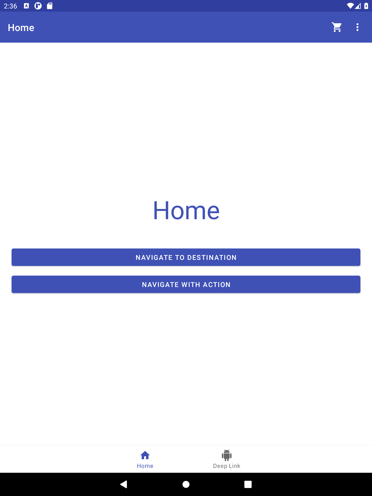

# Android Navigation

After following
[Android Navigation Codelab](https://codelabs.developers.google.com/codelabs/android-navigation/)
the final project looks like this one.

The intention of this code is to:
- show how to use *navigation components*
- provide an example of *deep linking*
- show how deep linking is used from a *widget*

There are 3 options related to *global navigation*:
- Home
- Deep Link
- Settings

## Mobile
### Mobile in Portrait

When the app uses a botton navigation, both *Home* and *Deep Link* will appear there.
The *Settings* option will appear in the overflow menu.

### Mobile in Landscape

When there is not enough vertical space, there is no bottom navigation, and the app uses a navigation drawer and all 3 options will land there.

See [Split screen](#split-screen) for another example where the app doesn't have enough vertical space.

## Tablet
### Tablet in Portrait

### Tablet in Landscape

When there is enough horizontal space, the navigation view will be visible all the time.

## Split screen

### Navigation activity
[When we have a height of at least 470 dp](app/src/main/res/layout-h470dp/navigation_activity.xml)
we use a *bottom navigation view*.

[When we have a width of at least 960 dp](app/src/main/res/layout-w960dp/navigation_activity.xml)
we use a *navigation view* that is visible all the time.

[When there is not enough vertical space](app/src/main/res/layout/navigation_activity.xml)
we use a *navigation view* inside a *drawer layout*.

